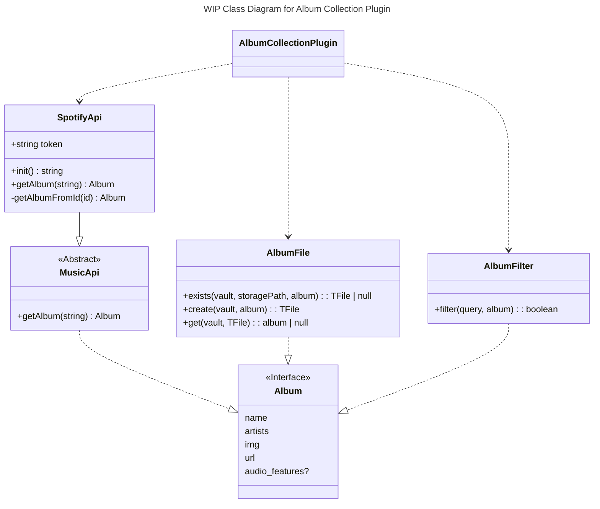

The `AlbumCollectionPlugin` will implment the following commands:
- Import Spotify Album - uses `SpotifyApi` to get an album () and then `AlbumFile` to create it
- Import Manual Album - provides a modal to enter in critical details yourself and then `AlbumFile` to create it
- Handle Code Block - Uses `AlbumFile` to get user's stored `Album`s and then uses passes the user's query to `AlbumFilter.filter()` to determine one-by-one whether it should be included. It will then decide itself how to display the included `Album`s to the user.

This architecture is meant to be flexible to any music api. As of now, all it needs to be able to do is take a string from the user and turn it into an `Album` object. How SpotifyApi determines what `Album` corresponds to the text you input is up to it. There's the potential to use the *search* api to be able to give suggestions for albums that match the search criteria for example...v

